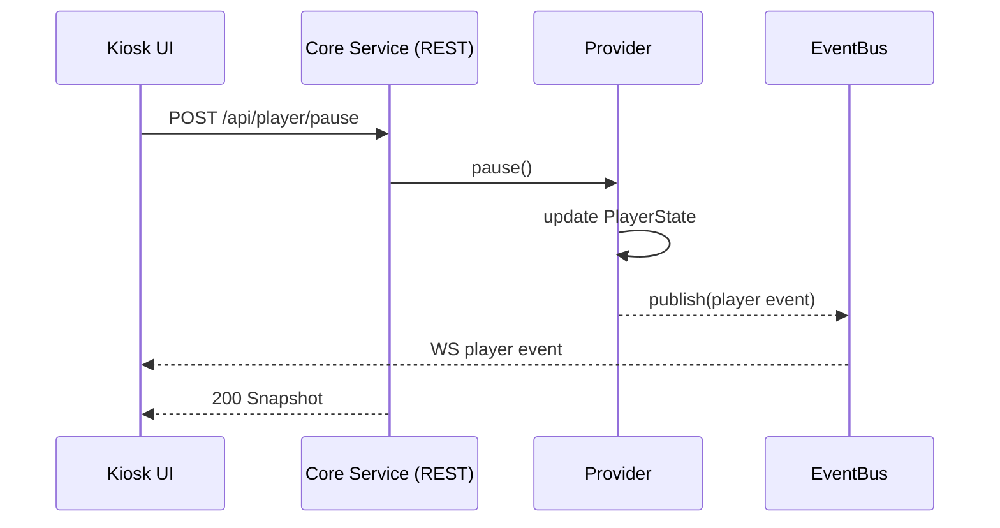
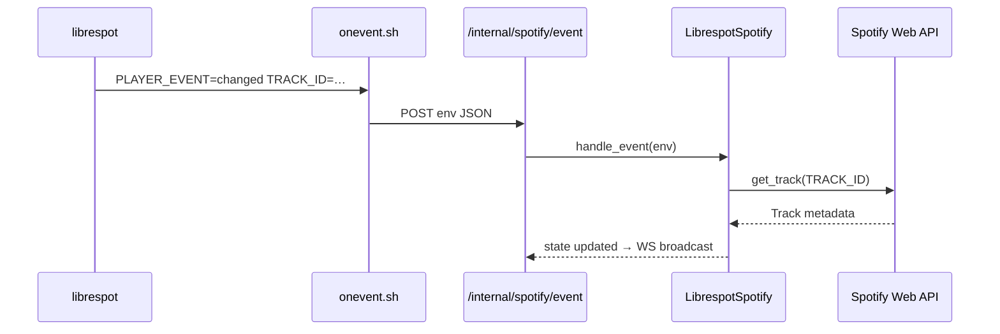

# HomeControl — Implementation Design

How the code that exists today (Phases 0–2) is organized. For system-level structure and
rationale, see [`architecture.md`](architecture.md). This document tracks the
implementation and should be updated as modules change.

## Core Service module map

```
core/homecontrol/
  models.py         # the API contract: Pydantic models exported to OpenAPI
  config.py         # Settings — env-driven (HOMECONTROL_*)
  events.py         # EventBus — async pub/sub fan-out
  state.py          # StateManager — single source of truth per unit
  app.py            # FastAPI factory: lifespan, routers, static UI mount
  __main__.py       # `python -m homecontrol` (uvicorn)
  api/
    rest.py         # /api/* control routes
    ws.py           # /ws realtime event stream
    internal.py     # /internal/* (localhost-only; excluded from OpenAPI)
  spotify/
    base.py         # SpotifyProvider ABC + PublishPlayer callback type
    mock.py         # MockSpotify — ticking playlist, no deps
    web.py          # SpotifyWebClient — Web API auth, metadata, control
    librespot.py    # parse_player_event + LibrespotSpotify provider
    __init__.py     # create_provider() factory
  scripts/
    export_openapi.py   # dump api/openapi.json (CI drift-checks this)
```

## State & event model

A unit's state is owned by **`StateManager`** (`state.py`). It holds the `UnitInfo`, the
active Spotify provider, and an **`EventBus`**. The flow is one-directional:

```
subsystem mutates state ──► provider.publish(PlayerState)
                              └─► StateManager._on_player_changed
                                    └─► EventBus.publish(Event)
                                          └─► every /ws subscriber queue
```

**`EventBus`** (`events.py`) is a minimal in-process pub/sub: each subscriber gets a
bounded `asyncio.Queue`; `publish()` fans out with `put_nowait` and **drops** on a full
queue rather than blocking the publisher (a slow UI client re-syncs from the next
snapshot). One process, many asyncio consumers — no external broker.

**Events** (`models.py`) are typed: `snapshot` (full state, sent once on WS connect),
`player` (a `PlayerState` delta), `unit` (a `UnitInfo` change). The `data` field carries
the JSON-serialized payload for that type.

## The API contract (`models.py`)

These Pydantic models *are* the contract for both the kiosk and the mobile app. FastAPI
exports them to `api/openapi.json`; CI fails on drift. `fastapi` and `pydantic` are pinned
exactly so the export is byte-deterministic across machines.

- **Enums:** `PlaybackState` (playing/paused/stopped/buffering), `RepeatMode`,
  `GroupRole` (solo/leader/member — for Phase 3), `EventType`.
- **`Track`** — id, title, artist, album, artwork_url, duration_ms.
- **`PlayerState`** — state, track, position_ms, volume (0–100), shuffle, repeat.
- **`UnitInfo`** — id, room, group_id, role.
- **`Snapshot`** — `{ unit, player, version }`, returned by `GET /api/state` and the
  initial WS event.
- Command bodies: `VolumeBody` (0–100), `SeekBody`.

## HTTP + WebSocket surface

REST (`api/rest.py`) is deliberately thin — validate, call the provider, return the new
`Snapshot`. Realtime flows over `/ws`, so clients can fire-and-forget commands and let
the socket reconcile.

| Method | Path | Purpose |
|--------|------|---------|
| GET | `/api/health` | liveness |
| GET | `/api/state` | full `Snapshot` |
| POST | `/api/player/play` \| `pause` \| `next` \| `previous` | transport |
| POST | `/api/player/seek` | `{position_ms}` |
| POST | `/api/player/volume` | `{volume}` (422 if out of 0–100) |
| WS | `/ws` | snapshot-on-connect, then deltas |
| POST | `/internal/spotify/event` | librespot onevent ingest (not in OpenAPI) |

## Spotify providers

**`SpotifyProvider`** (`base.py`) is the interface the rest of the service depends on:
`start/stop` lifecycle, a synchronous `snapshot()`, and async transport methods. A
provider reports state by calling the injected `publish` callback; the UI never touches a
provider directly. `create_provider()` (`__init__.py`) selects by
`settings.spotify_provider`; the librespot import is lazy so the mock path needs no httpx.

### MockSpotify (Phase 1)

A credential-free, hardware-free stand-in: a 3-track playlist that advances in real time
via a 1s tick loop, with working transport. Lets the entire API + UI be developed and
demoed on any machine. Default provider.

### LibrespotSpotify (Phase 2)

librespot runs as its **own systemd service** (a Connect receiver); this provider does
**not** spawn it. Two information paths:

- **Fast state — events.** librespot's `--onevent` hook posts its environment to
  `/internal/spotify/event`; `StateManager.handle_spotify_event` routes it to
  `LibrespotSpotify.handle_event`. `parse_player_event()` (pure, unit-tested) normalizes
  the env (`PLAYER_EVENT`, `TRACK_ID`, `DURATION_MS`, `POSITION_MS`, `VOLUME`) into a
  `PlayerEvent`, including 16-bit→percent **volume normalization**.
- **Rich state + control — Web API.** `SpotifyWebClient` (`web.py`) refreshes an OAuth
  access token from the stored refresh token, resolves librespot's `device_id` by name,
  fetches track metadata, and drives transport (`play/pause/next/previous/seek/volume`)
  targeting that device. `ensure_active()` transfers playback to the device first
  (Spotify requires the target device to be active).

A 1s **tick loop** advances `position_ms` locally for smooth UI; a 10s **reconcile loop**
pulls `GET /me/player` to correct drift. Metadata-fetch failures are swallowed and fall
back to a bare `Track` (id + duration) so playback state never breaks on a network blip.

## Application lifecycle (`app.py`)

`create_app()` builds the FastAPI app with a lifespan that constructs the `StateManager`,
calls `start()` (provider background tasks begin), and `stop()` on shutdown. Routers are
mounted; if `ui/dist` exists it is served at `/` so a unit runs as **one process**. CORS
is open for the Vite dev server (`:5173`).

## Sequence flows

### Transport command (kiosk → playback)



### librespot event ingest (Phase 2)



## Kiosk UI (`ui/`)

Svelte + Vite, fixed 1024×600. The Core Service serves the built `dist/` in production; in
dev Vite proxies `/api` and `/ws` to `:8080`.

- **`src/lib/store.js`** — the client mirror. Svelte stores: `connected`, `unit`,
  `player`. `connect()` opens `/ws`, applies `snapshot`/`player`/`unit` messages, and
  **auto-reconnects** on close. A `requestAnimationFrame` loop interpolates `position_ms`
  between server ticks for a smooth progress bar. `commands.*` are fire-and-forget POSTs.
- **`src/App.svelte`** — header (room + connection dot), `NowPlaying`, reconnect banner.
- **`src/lib/NowPlaying.svelte`** — artwork, title/artist/album, tap-to-seek progress bar,
  prev/play-pause/next, volume slider — all wired to `commands`.
- **`src/app.css`** — kiosk baseline (exact 1024×600, no scroll/selection/cursor).

## Provisioning model (`provisioning/`)

Each phase ships its own installer so bring-up stays incremental and reviewable.

- **`install.sh`** (Phase 0) — system packages (Python, Chromium, PipeWire, Avahi),
  service user, venv, optional UI build, unit identity (`/etc/homecontrol/unit.env`), and
  the `homecontrol-core` + `homecontrol-kiosk` systemd units.
- **`systemd/`** — `homecontrol-core.service`, `homecontrol-kiosk.service`,
  `librespot.service`. All `Restart=always`.
- **`kiosk/start-kiosk.sh`** — waits for `/api/health`, then launches Chromium in kiosk
  mode. Auto-detects `chromium` vs `chromium-browser` and only passes the Wayland flag
  under Wayland.
- **`phase2-spotify.sh`** — installs librespot, seeds Spotify env, installs
  `librespot.service`. **`spotify/onevent.sh`** is the event hook; **`spotify/pair.py`**
  is a stdlib-only one-time OAuth pairing to mint the refresh token.
- **`healthcheck.sh`** — read-only per-layer status (Core, UI, PipeWire, Avahi, Spotify,
  kiosk).

Unit identity and secrets live in `/etc/homecontrol/unit.env` (`HOMECONTROL_*`), never in
the repo.

## Testing

`core/tests/` — `test_api.py` (REST + WS contract, mock provider) and
`test_spotify_librespot.py` (pure event parsing, volume normalization, event→state
transitions with a stubbed Web client, the factory). All network-free. CI also runs
`ruff`, the OpenAPI drift check, and the Vite build.

**Not covered by tests** (needs hardware — see
[`hardware-validation.md`](hardware-validation.md)): real librespot Connect registration,
Web API token refresh/control against live Spotify, audio output, the onevent shell hook,
and the systemd/kiosk integration.
